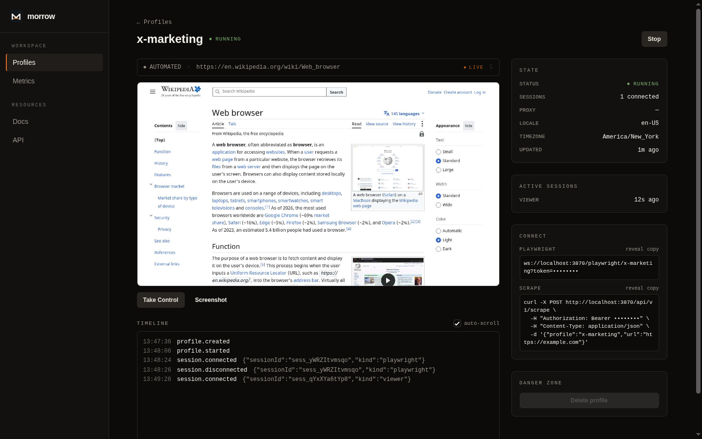
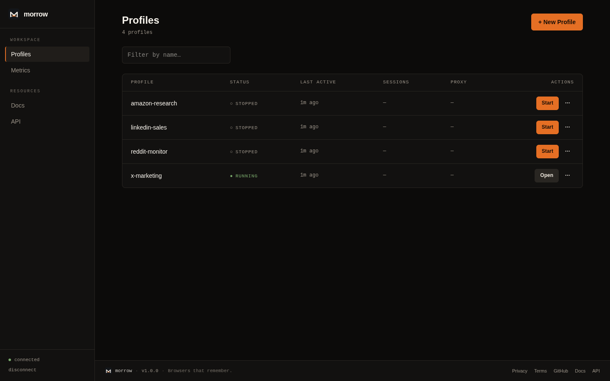
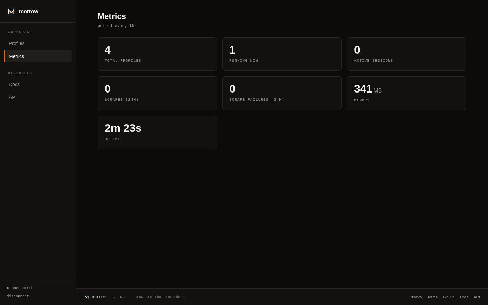
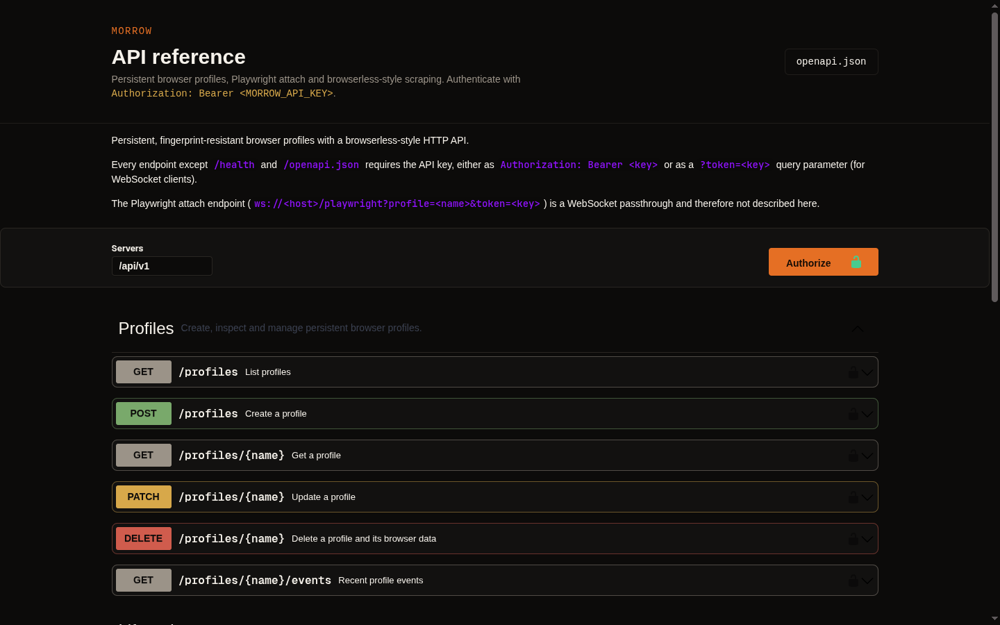
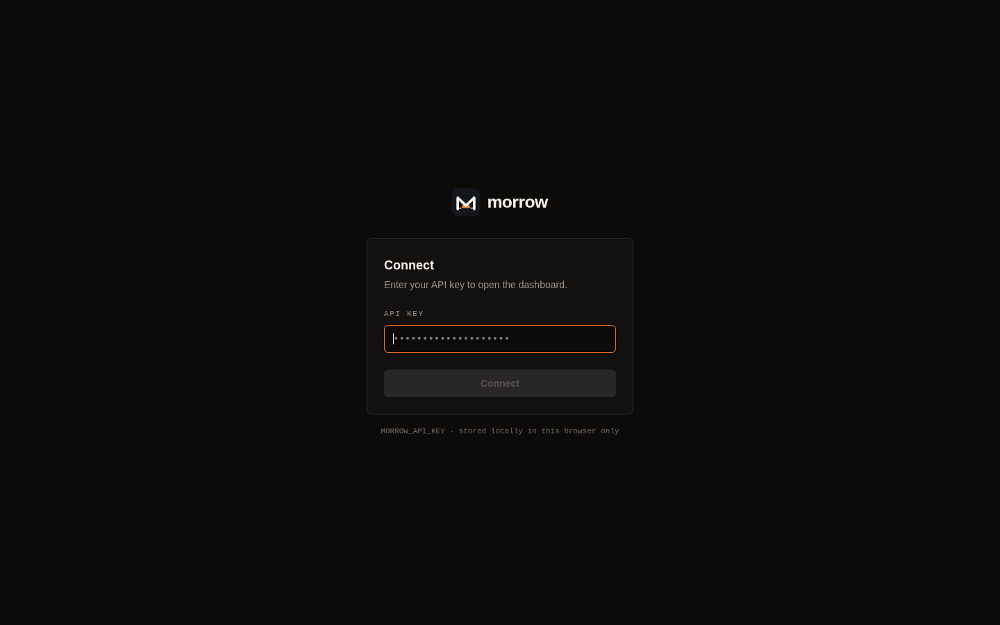

# Morrow

**Browsers that remember.** Persistent, fingerprint-resistant browser
infrastructure for humans and machines.

Create a profile once, log in once, and come back tomorrow — the browser is
still there, still authenticated, and still hard to fingerprint. Every Morrow
profile is a real, persistent [Camoufox](https://camoufox.com) browser — an
anti-detection Firefox fork — with a **stable, spoofed fingerprint** (user
agent, screen, canvas/WebGL, audio, fonts, timezone, locale) that stays
consistent across restarts. Cookies, local storage, and logins are written to
disk and survive restarts, so a profile behaves like a returning human on a
real machine rather than a fresh headless bot.

Because the fingerprint is coherent and persistent, profiles trip far fewer
bot-detection walls and CAPTCHAs than stock headless Chromium — see
[Stealth & fingerprinting](#stealth--fingerprinting). A profile can be driven
from four directions at once, all sharing the same identity —

- a **human**, through the dashboard's live viewer and takeover control,
- **REST**, one-shot scrape/screenshot/content endpoints (with or without an
  authenticated profile behind them),
- **Playwright**, any stock client attaching straight to the persistent
  browser over a websocket,
- an **AI agent**, through 13 MCP tools operating on the same persistent,
  optionally logged-in profile.

v1.0.0 is the complete story: dashboard + human takeover, Playwright attach,
the scrape family with OpenAPI docs, and MCP for agents — all four surfaces
sharing one durable browser per profile.

## Screenshots

A profile's detail page — the live remote browser streams the real page as
JPEG frames, with the control lock, connect snippets, active sessions, and the
event timeline alongside it:



<table>
  <tr>
    <td width="50%"><br/><sub>Persistent profiles, each a durable browser identity.</sub></td>
    <td width="50%"><br/><sub>At-a-glance instance metrics.</sub></td>
  </tr>
  <tr>
    <td width="50%"><br/><sub>OpenAPI reference at <code>/api-docs</code> — generate a client.</sub></td>
    <td width="50%"><br/><sub>Single API key, kept in the browser.</sub></td>
  </tr>
</table>

## What works in v1

This is the MVP end to end (docs/vision.md §32) — every step is a real,
tested code path today:

1. **Create a profile** — `POST /api/v1/profiles`, or the dashboard.
2. **Open it remotely** — start it and open the dashboard's live viewer,
   streaming the real browser as ~10fps JPEG frames over a websocket.
3. **Navigate to a site** — from the viewer, the REST API, Playwright, or an
   MCP `navigate` call.
4. **A human logs in by hand** — press **Take Control** in the viewer; mouse,
   scroll, and keyboard go straight to the remote browser.
5. **Close it** — `POST /api/v1/profiles/:name/stop` flushes cookies and
   storage to disk.
6. **Reopen it — still logged in** — start it again; the persistence tests
   (`tests/integration/persistence.test.ts`) assert cookies set before a stop
   are still there after a cold restart, with an identical browser
   fingerprint.
7. **Connect Playwright** — `firefox.connect("ws://.../playwright/<profile>?token=...")`
   attaches to the profile's persistent context, lazily starting it if needed.
8. **Automate it** — drive the attached Playwright `Page` (or MCP's
   `click`/`type`/`press_key`/`scroll`/`wait_for`) like any other browser.
9. **Scrape the authenticated page** — `POST /api/v1/scrape` (or the MCP
   `scrape` tool) with `"profile": "<name>"` runs inside that same
   logged-in context — no cookie/session handoff required.
10. **Clean Markdown out** — Readability-based `article` extraction, or plain
    `markdown`/`text`, documented at `/api-docs` (OpenAPI 3).

On top of all ten: an **MCP server at `/mcp`** lets an AI agent do the same
create → navigate → authenticate → automate → scrape flow itself, acting
inside a persistent, potentially human-authenticated identity instead of a
throwaway browser. See [MCP](#mcp) below.

## Stealth & fingerprinting

Most automation stacks are trivially detectable: stock headless Chromium leaks
`navigator.webdriver`, a mismatched or missing fingerprint, and a brand-new
cookie jar on every run. Detection vendors flag that in milliseconds, and the
result is CAPTCHAs, blocks, and dead sessions.

Morrow is built on **[Camoufox](https://camoufox.com)**, an anti-detection
Firefox fork, and leans on the two things that actually move the needle:

- **A coherent, spoofed fingerprint.** Each profile is assigned a realistic
  fingerprint — user agent, platform, screen and viewport, hardware
  concurrency, canvas/WebGL, audio, font metrics, timezone, and locale — that
  is internally consistent (no headless tells, no contradictions between
  layers). Camoufox applies these at the C++/engine level, not via detectable
  JS patches, so `navigator.webdriver` and the usual automation giveaways are
  absent.
- **That fingerprint is persistent.** Morrow generates it once per profile and
  pins every value — including the canvas/audio/font seeds that would otherwise
  re-randomize on each launch — so the identity is *byte-identical across
  restarts*. A returning profile looks like the same real machine coming back,
  not a new bot each time. Combined with persisted cookies and logins, that is
  what a genuine returning user looks like.

The practical effect: profiles pass far more bot-detection checks and hit far
fewer CAPTCHAs than stock headless browsers, especially on sites you've already
logged into with that profile. Add a residential proxy per profile
(`"proxy"` on create) and the network origin lines up with the identity too.

**Honest scope:** Morrow does not *solve* CAPTCHAs, and no anti-detection tool
is a guarantee against a determined, well-resourced detector. What it does is
remove the cheap, obvious tells and present a stable, human-shaped identity —
which is enough to get through the overwhelming majority of routine
fingerprint- and reputation-based walls. Use it responsibly and within the
terms of the sites you automate.

## Run (development)

    cp .env.example .env   # set MORROW_API_KEY
    npm install
    npm run dev            # http://localhost:3000

Open the dev server at `http://localhost:3000`. If you reach it from any other
host — a LAN IP, a hostname like `morrow.local`, or a tunnel — Next.js blocks
its `/_next/*` dev assets as cross-origin (the page shell loads but scripts and
hot-reload fail, which looks like a CORS error). List those hosts in
`MORROW_DEV_ORIGINS` (comma-separated, no protocol/port) and restart:

    MORROW_DEV_ORIGINS=morrow.local,192.168.1.50 npm run dev

This only affects `npm run dev`; the production image serves assets same-origin
and is unaffected.

## Run (Docker)

    docker run -e MORROW_API_KEY=secret -v morrow-data:/data -p 3000:3000 ghcr.io/jekyo/morrow:latest

## Dashboard

Open <http://localhost:3000/> and enter your `MORROW_API_KEY` — it is kept in
the browser's localStorage and sent with every request, so you only do this
once per browser.

From there you can create a profile, open it, and start it. The profile page
embeds a live viewer of the real browser: it streams the page as ~10fps JPEG
frames over a websocket. Press **Take Control** to drive it — mouse, scroll and
keyboard go straight to the remote browser, so you can log into a site by hand
— then **Release** to hand it back to automation. Only one controller at a time;
the viewer shows whether the profile is `AUTOMATED` or under `HUMAN CONTROL`.

Whatever you do while in control is written to the profile like any other
session, so a manual login persists for later API and Playwright use.

## Profiles API

Profiles are persistent Camoufox browser identities: create one, start it, drive it, stop it — cookies, local/session storage and logins are written to disk and are still there next time you start it. All requests need `Authorization: Bearer $MORROW_API_KEY`.

Create a profile:

    curl -X POST http://localhost:3000/api/v1/profiles \
      -H "Authorization: Bearer $MORROW_API_KEY" \
      -H "Content-Type: application/json" \
      -d '{"name": "research-eu", "locale": "de-DE"}'

Start it (launches the browser and pins its fingerprint for future starts):

    curl -X POST http://localhost:3000/api/v1/profiles/research-eu/start \
      -H "Authorization: Bearer $MORROW_API_KEY"

Stop it (flushes browser state to disk):

    curl -X POST http://localhost:3000/api/v1/profiles/research-eu/stop \
      -H "Authorization: Bearer $MORROW_API_KEY"

Profile state (cookies, storage, logins) persists on disk across restarts, so stopping and starting the same profile resumes exactly where it left off.

## Scraping

Browserless-style HTTP endpoints for one-shot page work — screenshots, raw HTML,
and cleaned markdown/article extraction. All requests need
`Authorization: Bearer $MORROW_API_KEY` and a `url` or `html` target.

Get markdown from a page:

    curl -X POST http://localhost:3000/api/v1/scrape \
      -H "Authorization: Bearer $MORROW_API_KEY" \
      -H "Content-Type: application/json" \
      -d '{"url": "https://example.com", "format": "markdown"}'

`format` also accepts `text` (plain innerText) and `article` (Readability
title/byline/excerpt/content/text plus a markdown rendering).

Take a screenshot:

    curl -X POST http://localhost:3000/api/v1/screenshot \
      -H "Authorization: Bearer $MORROW_API_KEY" \
      -H "Content-Type: application/json" \
      -d '{"url": "https://example.com", "fullPage": true}' \
      -o screenshot.png

Get the rendered HTML:

    curl -X POST http://localhost:3000/api/v1/content \
      -H "Authorization: Bearer $MORROW_API_KEY" \
      -H "Content-Type: application/json" \
      -d '{"url": "https://example.com"}'

Add `"profile": "research-eu"` to any of the three requests to run the scrape
inside that profile's persistent, logged-in browser context instead of a
throwaway one — no cookie or session management required for sites you're
already authenticated with.

All three also accept page options: `gotoOptions`, `waitForSelector`,
`waitForTimeout`, `waitForFunction`, `viewport`, `rejectResourceTypes`,
`rejectRequestPattern`, `setExtraHTTPHeaders`, `bestAttempt`.

Full request/response shapes are documented at `/api-docs` (a themed Swagger
UI), backed by an OpenAPI 3 document at `/api/v1/openapi.json` — point any
OpenAPI client generator at it to produce a typed SDK.

## Connect with Playwright

Any stock Playwright (>= matching 1.60.x) attaches straight to a profile's
persistent browser — the profile auto-starts on connect:

```ts
import { firefox } from "playwright";

const browser = await firefox.connect(
  "ws://localhost:3000/playwright/x-marketing?token=" + process.env.MORROW_API_KEY
);
const context = browser.contexts()[0]; // the profile's persistent context
const page = await context.newPage();
await page.goto("https://x.com");
```

Everything you do — logins, cookies, storage — lands in the profile and is
still there tomorrow. Client playwright version must match the server's
major.minor (currently 1.60.x).

## MCP

Morrow serves an MCP server over streamable HTTP at `/mcp`, gated by the same
`MORROW_API_KEY` (bearer header or `?token=`). Point any MCP client at
`http://host:3000/mcp`:

```json
{
  "mcpServers": {
    "morrow": {
      "url": "http://localhost:3000/mcp",
      "headers": {
        "Authorization": "Bearer YOUR_MORROW_API_KEY"
      }
    }
  }
}
```

(Claude Desktop-style `mcpServers` config, `type: "http"` — check your
client's docs for the exact key names it expects for a remote streamable-HTTP
server vs. a local stdio one; the URL + bearer header above are the two things
every client needs.)

The transport is stateless — no session ID, no server-initiated stream — one
request in, one response out. That's a deliberate simplification, not a
limitation: **Morrow's persistence story is the browser, not the MCP
session.** Every tool call that touches a page auto-starts the target profile
if it's stopped and then acts on that profile's *already-running* browser, so
state (cookies, logins, local storage, open tabs) survives across separate
tool calls, separate MCP sessions, even server restarts — the same profile an
agent navigated and logged into an hour ago is still logged in now.

This is the differentiator over a stock browser-automation MCP server: those
spin up a throwaway browser per session (or per call) with a blank profile.
Morrow's tools act *inside* a persistent, optionally human-authenticated
identity — an agent can pick up exactly where a human (or an earlier agent
run) left off, with no cookie/session handoff required.

13 tools, all thin wrappers over the same `ProfileManager` / scrape code the
REST API and dashboard use:

| Tool | What it does |
| --- | --- |
| `list_profiles` | List all profiles and their status |
| `create_profile` | Create a new profile (`name`, optional `proxy`/`locale`/`timezone`) |
| `start_profile` | Start a profile's browser |
| `stop_profile` | Stop a profile's browser (flushes state to disk) |
| `navigate` | Navigate the profile's active page to a URL |
| `snapshot` | Compact accessibility (aria) tree of the current page as YAML with `[ref=eN]` handles — the agent-friendly view |
| `click` | Click an element matching a selector |
| `type` | Fill an input (optionally submit with Enter) |
| `press_key` | Press a keyboard key |
| `scroll` | Scroll the page by dx/dy pixels |
| `wait_for` | Wait for a selector to appear |
| `screenshot` | Screenshot the current page as a PNG image |
| `scrape` | Scrape the current page (or a given url) into markdown/text/article |

All page-control tools take a `profile` argument and act on that profile's
active page, auto-starting it if it's stopped — so a single agent
conversation can `create_profile`, `navigate` to a login page, and (via the
dashboard's human takeover, or by driving `click`/`type` itself) authenticate
once, then keep calling `navigate`/`scrape`/`screenshot` against that same
logged-in identity indefinitely.

Docs: `docs/` — vision, v1 spec, UI spec, design system.
